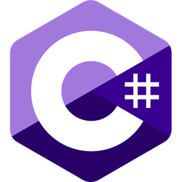
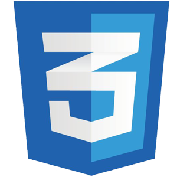
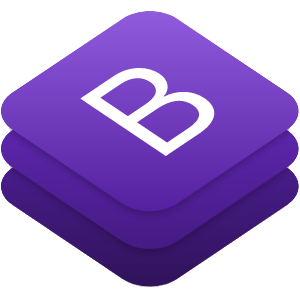

### Hey there, I'm Jonas - Full Stack Web Developer 👋

"...a code lover and passionate about making people's life easier and helping them to make better decisions through technologies 💻"

### Experience with:
 

 << Click on to see details

### - 🌱 I’m currently learning:

 << Click on to see details