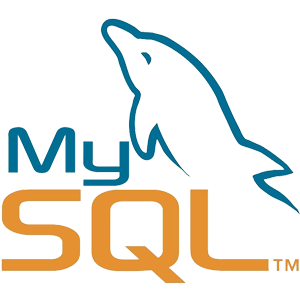

### Hey there, I'm Jonas - Full Stack Web Developer 👋

"...a code lover and passionate about making people's life easier and helping them to make better decisions through technologies 💻"

### Experience with:
[][CSharp]

MVC
Microsoft SQL
MySQL
HTML5
CSS3
Bootstrap
Meterial UI
REST API
Git

### - 🌱 I’m currently learning:
Node.js
React.js
React Native
TypeScript

[CSharp]: https://docs.microsoft.com/en-us/dotnet/csharp/getting-started/